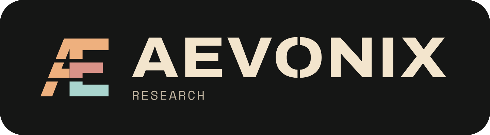
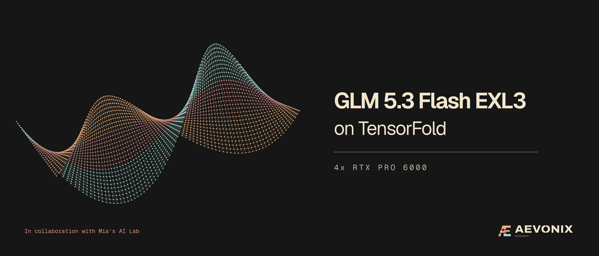
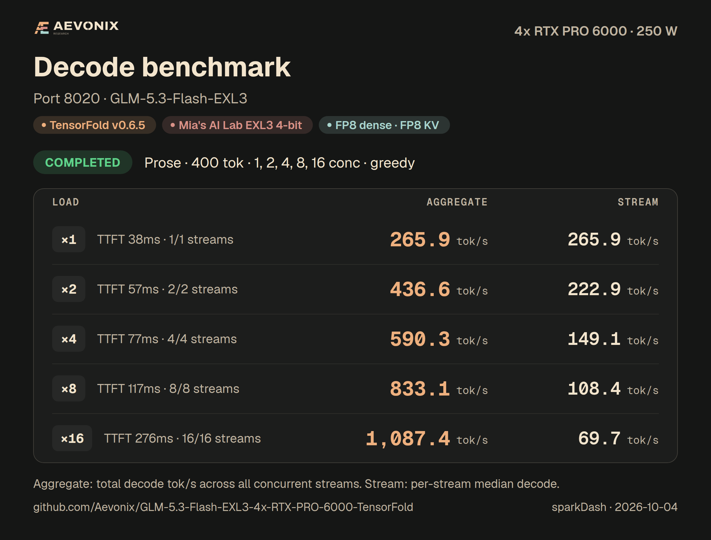
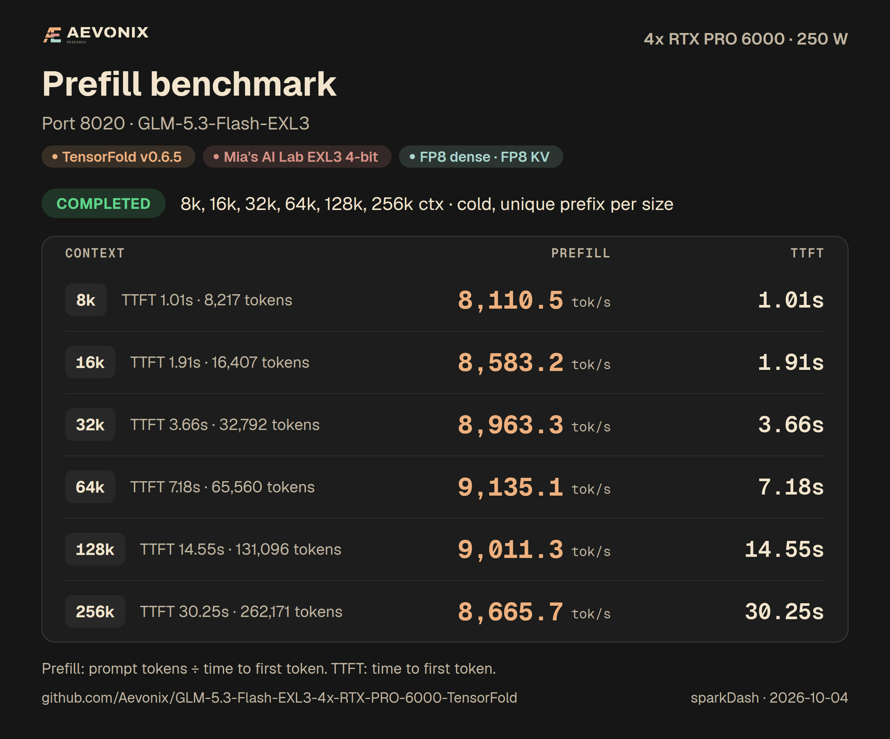
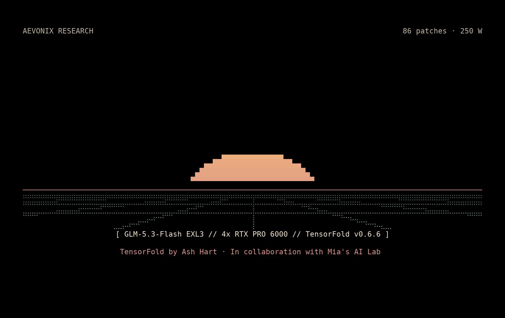

<!-- releasekit:header:start -->
<p align="center">
  <a href="https://aevonix.com">
    
  </a>
</p>

<h1 align="center">GLM-5.3-Flash EXL3 on 4x RTX PRO 6000 with TensorFold</h1>

<p align="center">A one-command recipe for 4x RTX PRO 6000, with text and vision on one Linux host.</p>

<p align="center"><sub>by <a href="https://aevonix.com">Aevonix Research</a> · in collaboration with <a href="https://x.com/MiaAI_lab">Mia's AI Lab</a></sub></p>

<p align="center">
  <a href="https://aevonix.com"></a>
  <a href="https://huggingface.co/Mia-AiLab"></a>
  <a href="https://github.com/ashhart/TensorFold"></a>
  
  <a href="LICENSE"></a>
</p>

<p align="center"></p>
<!-- releasekit:header:end -->

<!-- releasekit:summary:start -->
This one-command recipe serves **GLM-5.3-Flash** on one Linux host with **four 96 GB RTX PRO 6000 Blackwell GPUs**, through an
OpenAI-compatible API, with **40 concurrent requests**, **1,048,576 tokens per request**, tool calling
and structured outputs. Images are supported by default. This recipe combines [TensorFold](https://github.com/ashhart/TensorFold) v0.6.6,
Mia's AI Lab's EXL3 checkpoint and recipe patches, and Aevonix Research's single-host PCIe optimizations.
One command builds, downloads, tunes and starts it.

- **Checkpoint:** [`Mia-AiLab/GLM-5.3-Flash-EXL3-4bpw-TensorFold`](https://huggingface.co/Mia-AiLab/GLM-5.3-Flash-EXL3-4bpw-TensorFold),
  EXL3 routed experts at 4 bits per weight, with dense layers converted to FP8 at load time.
- **Drafter:** [`incoai/GLM-5.3-Flash-DFlash2`](https://huggingface.co/incoai/GLM-5.3-Flash-DFlash2),
  plus copy drafts. DFlash2 is non-commercial; `DRAFTER=mtp` uses the checkpoint's own MTP head instead.
- **API model id:** `glm-5.3-flash`.
- **Context:** 1,048,576 tokens per request, sharing one 5,099,520-token FP8 KV pool. Forty full windows at once are not promised.
- **Concurrency:** 40 requests by default, with a 128-row verification window.
- **One command:** `./start.sh`; restart with `./start.sh restart`, stop with `./stop.sh`.
<!-- releasekit:summary:end -->

## Performance

The published measurements come from the TensorFold v0.6.5 build. A/B validation of v0.6.5 and v0.6.6
used the same checkpoint and settings on four RTX PRO 6000 Blackwell Server Edition GPUs, separate from
the measured Max-Q host. Gate and gatelong were identical, first tokens matched 40/40, and tool bursts
were unchanged. Speed was within about 1%, with no regression. The `--name-priority` smoke passed.
See [TensorFold v0.6.6 validation](docs/NOTES.md#tensorfold-v066).

<!-- releasekit:performance:start -->
Four RTX PRO 6000 Blackwell Max-Q GPUs, one PCIe host.

FP8 dense, FP8 KV, stock DFlash2, fnc7:0.3.

[sparkDash](https://github.com/MiaAI-Lab/sparkDash) v1.8.9 measured TensorFold on 2026-10-04.

Power: **250 W per GPU**.

sampling: greedy; temperature: 0; top_p: 1; thinking: off; reply tokens: 400.

Decode aggregate is total decode throughput across concurrent requests; per-request speed and TTFT are medians. Prefill uses actual prompt token counts.
<!-- releasekit:performance:end -->

**Decode** (aggregate across the concurrent requests, median per request, and median time to first token)

<!-- releasekit:decode:start -->
| Concurrent requests | Prose | Prose, per request | TTFT | Structured | Structured, per request | TTFT |
| ---: | ---: | ---: | ---: | ---: | ---: | ---: |
| 1 | 265.9 tok/s | 265.9 tok/s | 38 ms | 539.3 tok/s | 539.3 tok/s | 39 ms |
| 2 | 436.6 tok/s | 222.9 tok/s | 57 ms | 881.1 tok/s | 444.0 tok/s | 51 ms |
| 4 | 590.3 tok/s | 149.1 tok/s | 77 ms | 986.6 tok/s | 305.6 tok/s | 97 ms |
| 8 | 833.1 tok/s | 108.4 tok/s | 117 ms | 1,492.1 tok/s | 223.5 tok/s | 108 ms |
| 16 | 1,087.4 tok/s | 69.7 tok/s | 276 ms | 2,054.0 tok/s | 137.7 tok/s | 273 ms |
<!-- releasekit:decode:end -->

Within a fixed configuration, the [exactness checks](#checks) compare replies served together with the same
requests served alone, and drafted replies with serial replies.

**Code** (the same decode measurements)

<!-- releasekit:code:start -->
| Concurrent requests | Code | Code, per request | TTFT |
| ---: | ---: | ---: | ---: |
| 1 | 430.8 tok/s | 430.8 tok/s | 48 ms |
| 2 | 615.9 tok/s | 313.1 tok/s | 69 ms |
| 4 | 774.1 tok/s | 218.8 tok/s | 381 ms |
| 8 | 1,022.9 tok/s | 143.1 tok/s | 154 ms |
| 16 | 1,279.7 tok/s | 85.7 tok/s | 282 ms |
<!-- releasekit:code:end -->

**Prefill** (cold prompts, with actual prompt token counts)

<!-- releasekit:prefill:start -->
cold, unique prefix per size.

| Prompt | Prefill | Time to first token |
| --- | ---: | ---: |
| 8,217 tokens | 8,110 tok/s | 1.01 s |
| 16,407 tokens | 8,583 tok/s | 1.91 s |
| 32,792 tokens | 8,963 tok/s | 3.66 s |
| 65,560 tokens | 9,135 tok/s | 7.18 s |
| 131,096 tokens | 9,011 tok/s | 14.55 s |
| 262,171 tokens | 8,666 tok/s | 30.25 s |
<!-- releasekit:prefill:end -->

**Prompt reuse** (separate cold-prompt and warm-conversation workloads)

<!-- releasekit:prompt-reuse:start -->
Separate client workload from sparkDash, measured alone. Cold values are medians of three fresh prompts; warm values are TTFT p50 for turns 2-5 of a conversation beginning near 130K tokens. Warm requests use temperature 0.6; thinking is explicitly off or enabled at low effort. Prompt sizes differ, so these are not matched cache-speedup ratios.

| Prompt | First time | Next time |
| --- | ---: | ---: |
| 32K-token prompt | 4.01 s | Not measured by this workload |
| 100K-token prompt | 12.48 s | Not measured by this workload |
| 140K-token prompt | 17.76 s | Not measured by this workload |
| A 130K-token conversation's next turn, thinking off | 16.503 s | 0.3950 s |
| A 130K-token conversation's next turn, low effort | 16.443 s | 0.4195 s |

| Thinking | First-turn actual tokens | Next-turn actual tokens | Warm maximum TTFT |
| --- | ---: | ---: | ---: |
| Off | 130,339 | 132,357, 134,388, 136,409, 138,425 | 0.398 s |
| Low effort | 129,934 | 131,952, 133,983, 136,004, 138,020 | 0.424 s |
<!-- releasekit:prompt-reuse:end -->

**Quality.** Small functional checks for this configuration.

<!-- releasekit:quality:start -->
| Benchmark | Score | Scope |
| --- | ---: | --- |
| Tool calls | 40/40 | Historical v0.6.2 measurement, not rerun for this port. Separate controlled FP8 and q4 dense functional checks |
| JSON, instruction only | 20/20 | Historical v0.6.2 measurement, not rerun for this port. Separate production-default probes |
| JSON with response_format | 20/20 | Historical v0.6.2 measurement, not rerun for this port. Separate production-default probes |
| Needles at 100K / 200K / 250K | 3/3 at each length | Historical v0.6.2 measurement, not rerun for this port. Separate controlled functional checks |
| Images | 3/3 | Historical v0.6.2 measurement, not rerun for this port. Separate controlled functional checks |
| Tool bursts, default choice / required | 80/90 / 90/90 | Historical v0.6.2 measurement, not rerun for this port. Separate tool burst probes |

Historical functional and dense-fidelity scores are retained from the v0.6.2 recipe; they are not new v0.6.5 measurements.

Historical v0.6.2: Small separate functional checks do not establish complete model equivalence or a single production qualification run.

Historical v0.6.2: A recorded qualification used a modified drafter for some tool, image and stress checks and scored 15/20 on its JSON subtest. Stock DFlash2 was restored for final production performance and its 40-stream exactness gate. Separate production-default JSON probes scored 20/20.

Historical v0.6.2: Exactness gates compare drafted versus serial and concurrent versus solo output within a fixed checkpoint, precision and prompt arithmetic; they do not establish BF16 or original-model fidelity.

The v0.6.5 validation passed drafted versus serial, concurrent versus solo, image input, long-context saved hashes, and fresh versus resumed replay against a separately started v0.6.2 baseline. Exactness is within the fixed checkpoint, precision and prompt arithmetic and does not establish original-model fidelity.

The v0.6.5 capacity check accepted 1,048,568 prompt tokens plus an eight-token reply budget and returned 2 tokens in 155.52 seconds wall time. The measured shared KV pool held 5,099,520 tokens. This is a single-request capacity check, separate from TTFT measurements and saved-hash tests.

These tables retain the first user-flow sweep, including its latency outliers. Matched v0.6.2/v0.6.5 repeats found similar steady decode and prefill performance; first-use latency outliers also occurred on v0.6.2. The separate warm workload uses sampled replies and evolving histories, so small latency changes do not isolate engine overhead.

TensorFold v0.6.6 A/B validation on 2026-10-08 compared A, the current v0.6.5 build, with B, v0.6.6, using the same checkpoint and settings on four RTX PRO 6000 Blackwell Server Edition GPUs. Gate and gatelong were identical at concurrency levels 4, 8, 16, 32 and 40. First tokens and complete returned sequences matched 40/40. Tool bursts were identical: 80/90 default choice and 90/90 required choice. The default-choice misses remain. Speed was within about 1%, with no regression. The --name-priority smoke passed. This native A/B check is separate from the published v0.6.5 Max-Q measurements.

Details on the [model card](https://huggingface.co/Mia-AiLab/GLM-5.3-Flash-EXL3-4bpw-TensorFold) for the checkpoint's benchmark scores.
<!-- releasekit:quality:end -->

**Why FP8 dense is the default.** FP8 keeps the dense layers closer to the checkpoint's BF16 weights than 4-bit does.

<!-- releasekit:fidelity:start -->
Against this checkpoint's BF16 dense layers, on 100 fixed greedy prompts:

| Fidelity measurement | FP8 dense | 4-bit dense (`DENSE=q4`) |
| --- | ---: | ---: |
| First token agrees | 86/100 | 73/100 |
| Mean identical prefix | 12.9 tokens | 7.0 tokens |
| Entire 32-token reply agrees | 19/100 | 6/100 |

This compares dense formats within the EXL3 checkpoint, not against the original unquantized model.
In the controlled dense comparison, FP8 cost about **2% single-stream speed**, **11% cold TTFT** and
**7% warm TTFT** versus q4; aggregate throughput changes ranged from -1.8% to +1.5%.
`DENSE=q4` remains the speed option. Historical dense-format evidence from the v0.6.2 recipe. Costs are from paired dense-format tests, not subtraction of unrelated production runs.
<!-- releasekit:fidelity:end -->

Dense and KV quantization change numerics; chunked KDA also changes arithmetic. The exactness gates check drafted
versus serial and concurrent versus solo output within a fixed configuration. See [validation and limitations](docs/NOTES.md)
and [verification tools](tools/bench/README.md).

<!-- releasekit:cards:start -->
<p align="center">
  
  
</p>
<!-- releasekit:cards:end -->

At 300 W, sampled throughput improved through 16 streams, but the Max-Q cards overheated in the tested chassis; this release's reported numbers and operating configuration use **250 W**. The scripts warn about a different power limit and never change it.

## Requirements

- **Linux x86_64**, four **96 GB RTX PRO 6000 Blackwell** GPUs, working NVIDIA drivers and CUDA peer access
  between every pair. Keep them idle for the first compilation and launch-table autotune.
- **Docker with NVIDIA Container Toolkit**, a reachable Docker daemon and membership in the `docker` group
  (root can also run it). GPU access is tested inside the image before tuning.
- **At least 90,000 MiB (about 88 GiB) free on each selected GPU** at launch. The defaults reserve 7.5 GiB per rank and cap the
  shared KV allocation at 60 GiB per rank; the engine checks whether the requested context fits.
- **Disk:** budget 180 GiB for the checkpoint, 10 GiB for DFlash2, 40 GiB for image/build space and 10 GiB for
  kernels. The script adds these requirements when locations share a filesystem and skips ready downloads.
- Bash, Python 3, Git, GNU `patch`, `curl`, `gzip`, GNU coreutils and `flock`. Initial setup needs access to
  GitHub, NVIDIA's container registry, package indexes and Hugging Face.
- Optional **`HF_TOKEN`**, or a Hugging Face token file. The public checkpoint can be downloaded without one.

## Quick start

<p align="center">
  
</p>

```bash
git clone https://github.com/Aevonix/GLM-5.3-Flash-EXL3-4x-RTX-PRO-6000-TensorFold.git
cd GLM-5.3-Flash-EXL3-4x-RTX-PRO-6000-TensorFold
./start.sh
```

The first run checks the host, builds TensorFold v0.6.6 at the pinned commit with all 86 patches, downloads the pinned
checkpoint and drafter, compiles kernels and autotunes the launch table. This takes time and needs idle GPUs.
Later runs reuse what is ready. The script starts four local ranks, waits for the API, sends a short greedy
smoke request and prints `GLM-5.3-Flash-EXL3 is now LIVE! on port 8020` with the endpoint.

To avoid DFlash2's non-commercial weights, use `DRAFTER=mtp ./start.sh` on the first run. This selects the
checkpoint's own MTP head and defaults to **one concurrent request**. Other weights and software retain their
own licenses. Put this setting in `scripts/local.sh` to keep it for future starts.

Preview every setup and Docker command without Docker or GPUs:

```bash
DRY_RUN=1 ./start.sh
```

The API base URL is `http://127.0.0.1:8020/v1`. The default bind address is `0.0.0.0`; remote clients use the
server's address. Requests can override the default thinking-off setting with `chat_template_kwargs`.

```bash
curl -s http://127.0.0.1:8020/v1/models
curl -s http://127.0.0.1:8020/v1/chat/completions \
  -H 'Content-Type: application/json' -d '{
    "model": "glm-5.3-flash",
    "messages": [{"role": "user", "content": "Write a Python fibonacci function."}],
    "temperature": 0,
    "max_tokens": 2000
  }'

curl -s http://127.0.0.1:8020/v1/chat/completions \
  -H 'Content-Type: application/json' -d '{
    "model": "glm-5.3-flash",
    "messages": [{"role": "user", "content": "Return a JSON object with status set to ok."}],
    "response_format": {"type": "json_object"},
    "temperature": 0,
    "max_tokens": 128
  }'

./start.sh restart
./stop.sh
docker logs -f glm53-tf
curl -s http://127.0.0.1:8020/health
```

`stop.sh` stops the ranks and saves timestamped, gzipped logs under `logs/` before removing the container.
It keeps the newest **10** `glm53-*.tar.gz` archives (`LOG_KEEP`), containing all four rank logs and Docker
output. Read a rank log with `tar -xOzf logs/<archive>.tar.gz ./rank0.log`; the live files are under
`logs/current/`. Restart saves the previous run the same way. Stopping interrupts active requests.

**Troubleshooting.** Every failed check prints a stable code. Successful checks print `I_PLATFORM`, `I_GPU`, `I_DISK`,
`I_P2P` and `I_HF_TOKEN`; `I_DRY_RUN` means the checks and commands were only planned.

| Message | What to do |
| --- | --- |
| `E_CONFIG`: invalid setting | Use the allowed values in `scripts/config.sh`; MTP requires `PARALLEL=1`, and GPU indices must be distinct. |
| `E_PATCHES`: expected 86 patches | Restore the complete release's two patch folders. |
| `E_PLATFORM`: requires Linux x86_64 | Run this recipe on a supported Linux host. |
| `E_DEPENDENCY`: missing command | Install the named command from Requirements. |
| `E_DOCKER`: cannot talk to Docker | Start Docker and check access to its socket. |
| `E_DOCKER_GROUP`: login not in docker group | Add the account to the `docker` group and start a new login session. |
| `E_NVIDIA_RUNTIME`: NVIDIA runtime missing | Install and configure NVIDIA Container Toolkit for Docker. |
| `E_GPU`: cannot query GPU | Check the NVIDIA driver and the four indices in `GPUS`. |
| `E_GPU_MEMORY`: insufficient free memory | Stop other GPU work; each selected GPU needs at least `MIN_GPU_FREE_MIB`. |
| `E_GPU_BUSY`: GPU in use | Stop competing compute processes before startup and autotune. |
| `W_POWER`: limit differs from 250 W | Results may differ. Review the host's power and cooling configuration; the script changes neither. |
| `E_DISK`: insufficient space | Free space on the named filesystem or move `DATA_DIR`, model directories or Docker storage. Requirements are added when they share a filesystem. |
| `I_HF_TOKEN`: token absent | Public downloads can proceed. Supply `HF_TOKEN` or `HF_TOKEN_PATH` if access or rate limits require it. |
| `E_IMAGE`: build failed | Read the first build error; check disk space and access to the pinned upstream, base image and package indexes. |
| `E_DOWNLOAD`: download failed | Check free space, network access and optional token; rerun to resume the pinned download. |
| `E_P2P`: CUDA peer access failed | Check the driver and platform PCIe topology, ACS and IOMMU configuration. Every selected GPU pair must support CUDA peer access. |
| `E_AUTOTUNE`: compile/tuning failed | Read the compiler or kernel-check error, leave the GPUs idle and rerun. Incomplete tuning is never marked ready. |
| `E_PORT`: port in use | Stop its owner or change `PORT` / `MASTER_PORT`. |
| `E_LOCK`: operation in progress | Wait for the existing start, preparation or stop operation to finish. |
| `E_START`: container/rank failed | Inspect `logs/current/rank*.log` and `docker logs glm53-tf`; `./stop.sh` archives them. |
| `E_API`: readiness timeout | Inspect rank 0's log; increase `WAIT_TIMEOUT` if first-run kernels are still compiling. |
| `E_SMOKE`: request failed or empty reply | Inspect `logs/current/smoke.json` and the rank logs, then restart. |
| `E_LOG`: cannot archive logs | Fix `LOG_DIR` space or permissions. The stopped container is retained to preserve evidence. |
| `E_STOP`: stop/remove failed | Check `docker ps -a`, correct the Docker error and retry. |

An engine context-budget refusal means the requested window does not fit that start's memory budget. Free
GPU memory or set a smaller `CONTEXT`; the launcher does not silently change the measured default.

## Images and video

Vision is enabled by default (`VISION=1`). Send images as `image_url` content parts in a user message.
This example reads a local JPEG and sends it as a data URL:

```bash
IMG=$(base64 -w0 photo.jpg)
curl -s http://127.0.0.1:8020/v1/chat/completions -H 'Content-Type: application/json' -d '{
  "model": "glm-5.3-flash",
  "messages": [{"role": "user", "content": [
    {"type": "image_url", "image_url": {"url": "data:image/jpeg;base64,'"$IMG"'"}},
    {"type": "text", "text": "What is in this picture?"}]}],
  "temperature": 0,
  "max_tokens": 2000
}'
```

| Input | Content part |
| --- | --- |
| Image | `{"type": "image_url", "image_url": {"url": "data:image/jpeg;base64,..."}}` |
| Video | `{"type": "video_url", "video_url": {"url": "data:video/mp4;base64,..."}}` |

The vision tower runs on rank 0. The recipe accepts data URLs; external media URLs are disabled.
Set `VISION=0` before starting to serve text only.

## What `start.sh` and `scripts/prepare.sh` do

`./start.sh` shows each step as it runs:

1. Check the settings, Linux, Docker, NVIDIA runtime, GPU availability, free disk space and optional download token.
2. Build the pinned TensorFold image and apply all 86 release patches, skipping a matching image.
3. Download the pinned checkpoint and selected drafter, skipping ready downloads.
4. Check CUDA peer access, compile kernels and autotune the launch table, reusing a matching cache.
5. Start one container with four local TensorFold ranks. Rank 0 serves the API and each rank writes its own log.
6. Wait for the API, send a short greedy smoke request and print the LIVE message with the endpoint.

A running server is left in place unless `restart` is requested. Settings are validated before a restart
stops it. Stop and restart save the previous logs. If a rank exits, the container stops the other ranks.

`scripts/prepare.sh` performs the setup without starting the API. It builds from the pinned NVIDIA image,
installs TensorFold with the patches, PyAV and xgrammar, downloads the weights, checks peer access, and
compiles and tunes kernels. Image and tuning hashes decide what needs rebuilding. Re-running it skips ready work.

<!-- releasekit:autotune:start -->
One-time TP4 launch-table autotune.

The fresh-clone preparation, image build, kernel compilation, tuning, start, smoke and stop flow completed on the target GPU host. Later starts reuse the cached launch table.
<!-- releasekit:autotune:end -->

```bash
scripts/prepare.sh             # prepare the image, weights and kernels
scripts/prepare.sh --image     # prepare only the image
```

The revision pins are listed in [Configuration](#configuration). Downloads come directly from the publishers.
Serving uses the local weight directories with Hugging Face offline mode enabled.

## KV pool and memory

Requests share one pool for the per-token DSA cache and sparse indexer keys. KDA layers also keep
recurrent state. The per-request window and the shared pool are different limits:

| Setting | Default |
| --- | ---: |
| Concurrent requests (`PARALLEL`) | 40 |
| Maximum prompt plus reply (`CONTEXT`) | 1,048,576 tokens per request |
| KV representation (`KV`) | FP8 |
| Free-memory reserve (`MEMORY_RESERVE_GIB`) | 7.5 GiB per rank |
| Configured KV cap (`KV_POOL_GIB`) | 60 GiB per rank |
| Required free memory at launch (`MIN_GPU_FREE_MIB`) | 90,000 MiB per GPU |

<!-- releasekit:memory:start -->
The measured shared KV pool holds **5,099,520 tokens**. Each request allows up to **1,048,576 tokens** for prompt plus reply.
Long requests share the pool. One PCIe host with CUDA peer access between all four selected GPUs.

The maximum-context check accepted a **1,048,568-token prompt** plus an **8-token reply budget**. It returned **2 tokens**.

| Memory per GPU | Recorded value |
| --- | ---: |
| GPU 0, sampled peak during measurements | 95,114 MiB of 97,887 MiB |
| GPU 1, sampled peak during measurements | 93,986 MiB of 97,887 MiB |
| GPU 2, sampled peak during measurements | 93,986 MiB of 97,887 MiB |
| GPU 3, sampled peak during measurements | 93,986 MiB of 97,887 MiB |

Sampled at approximately three-second intervals across candidate preparation, startup and serving checks in an isolated window; brief transients can be missed.

Sampled peak GPU temperatures were GPU 0: 90.0 C, GPU 1: 84.0 C, GPU 2: 89.0 C, GPU 3: 85.0 C.
<!-- releasekit:memory:end -->

Forty full context windows at once are not promised. `/health` reports `pool_tokens` and `pool_free_tokens`.
The engine checks the requested window against the available memory. A context-budget refusal requires
freeing GPU memory or reducing `CONTEXT`; the launcher does not silently shrink it. `KV=bf16` needs more
memory. Dense and KV quantization and chunked KDA have separate numerical limits; see [Checks](#checks).

## Configuration

Settings come from the **environment**, then **`scripts/local.sh`**, then **`.env`**, then the defaults in
[`scripts/config.sh`](scripts/config.sh), in that order. `local.sh` is Bash; `.env` contains literal `KEY=value`
lines and is never executed. Both are ignored by Git. Copy `scripts/local.sh.example` for a starting point.

```bash
DENSE=q4 ./start.sh restart     # speed option
PORT=9000 ./start.sh           # another API port
NO_ANIM=1 ./start.sh           # static command deck, without the opener animation
```

| Setting | Default | Meaning |
| --- | --- | --- |
| `GPUS` | `0,1,2,3` | Four local GPU indices |
| `PORT` / `HOST` | `8020` / `0.0.0.0` | API listener |
| `SERVED_NAME` | `glm-5.3-flash` | API model id |
| `CONTAINER_NAME` / `IMAGE` | `glm53-tf` / `tensorfold-glm53:1.2.0` | Docker container and local image |
| `DENSE` | `fp8` | `fp8`, `q4` or checkpoint `bf16` dense layers |
| `DRAFTER` | `dflash2` | `mtp` avoids DFlash2 weights and needs `PARALLEL=1` |
| `DRAFT_POLICY` | `fnc7:0.3` | DFlash2 stopping policy |
| `PARALLEL` | `40` (`1` with MTP) | Concurrent requests, supported range 1-64 with DFlash2 |
| `CONTEXT` | `1048576` | Maximum prompt plus reply tokens per request |
| `KV` | `fp8` | KV representation; `bf16` needs more memory |
| `TF_GLM_MULTI_WINDOW` | `128` | Batched verify rows |
| `THINKING` / `REASONING_EFFORT` | `0` / `high` | Default thinking mode and effort |
| `MAX_TOKENS` | `32768` | Default completion budget when omitted by the request |
| `VISION` | `1` | Image and video input |
| `MEMORY_RESERVE_GIB` / `KV_POOL_GIB` | `7.5` / `60` | Free-memory reserve and KV cap per GPU |
| `DATA_DIR` | `${XDG_CACHE_HOME:-$HOME/.cache}/aevonix-glm53` | Download and kernel cache root |
| `MODEL_DIR` / `DFLASH2_DIR` / `KERNEL_CACHE` | Under `DATA_DIR` | Separate paths can be supplied |
| `LOG_DIR` / `LOG_KEEP` | `./logs` / `10` | Archived server logs |
| `WAIT_TIMEOUT` | `2400` | Seconds to wait for API readiness |
| `HF_TOKEN_PATH` | `${HF_HOME:-$HOME/.cache/huggingface}/token` | Optional login token file; `HF_TOKEN` takes precedence |
| `DRY_RUN` | `0` | `1` prints the plan and skips hardware checks |
| `NO_ANIM` | Unset | Set to `1` to show the static command deck immediately |
| `NO_COLOR` | Unset | Set to `1` to show the banner facts as plain text |

TensorFold v0.6.6 supports `--name-priority ID=background` for a model-name background default.
This launcher does not expose extra server arguments. The option is merged with the recipe's priority
lanes; explicit priorities and title requests retain their behavior.

The terminal opener runs for about 2.2 seconds on truecolor terminals at least 112 columns by 32 lines.
It leaves the command deck on screen while startup continues. Smaller terminals show a static or plain-text
version; redirected output contains no banner. Setting `NO_ANIM` or `NO_COLOR`, even to an empty value,
disables animation or color respectively.

The engine switches in `scripts/config.sh` match the measured production configuration, including NCCL
collectives over PCIe, copy-engine prompt exchanges, two prompt lanes, packed GPU sampling, fast DFlash2 and
incremental warm turns. FP8 sets `TF_GLM_LANE_INPUTS=0`; q4 uses `kda`. Each switch and its effect is listed
in [docs/PATCHES.md](docs/PATCHES.md). Kernel and tuning caches are keyed to the build and GPU configuration.

Pinned inputs:

| Input | Revision |
| --- | --- |
| TensorFold v0.6.6 | `cb2ebf0540f42604e2759b2ddef497861e928248` |
| Mia's EXL3 checkpoint | `78353f1f6eb2c96fa6c62de57b44345d1f497c38` |
| Inco AI DFlash2 | `bf582e4eacc1810f76656d1811693ff6c6737d2a` |

### Thinking and sampling

The default is thinking off (`THINKING=0`), with `REASONING_EFFORT=high` when thinking is enabled.
A request can override the thinking setting with `"chat_template_kwargs": {"enable_thinking": true}`
or `false`. Reasoning is returned in `reasoning_content`; the answer is in `content`.
A request that omits `max_tokens` starts with the configured completion budget of 32,768 tokens,
reduced to the space left in the context window.

Use `temperature: 0` for greedy decoding. Sampled requests can set `temperature`, `top_p`, `top_k`,
`min_p` and `seed`. **An omitted `top_k` is served as 20.** Send `top_k`
explicitly (for example `-1` to disable it) when you compare sampled runs with another engine.

The recipe retains thinking off and the pinned checkpoint's earlier-turn reasoning clearing.
`TF_GLM_CLEAR_THINKING=0` opts into upstream's keep-reasoning default. API keys are off unless
`TENSORFOLD_API_KEY` is explicitly configured in the environment or `.env`. Send it as a Bearer token
or `x-api-key`; `/health` remains open and `/metrics` requires the key when authentication is enabled.
The launcher authenticates its own readiness and smoke requests and does not print the key in dry runs.

### API notes

| Feature | Request or endpoint |
| --- | --- |
| Chat completions | `/v1/chat/completions`, with model `glm-5.3-flash` |
| Models | `/v1/models` |
| Health and metrics | `/health` and Prometheus `/metrics` |
| Tokenization | `/tokenize` and `/detokenize`, also under `/v1/` |
| Tool calls | `tools` and `tool_calls`; complete calls are streamed with schema-aware arguments |
| Structured outputs | `response_format` with `json_object` or `json_schema`, enforced with xgrammar |
| Prompt reuse | Reuses kept prompt state; shared prefixes and incremental warm turns are enabled by default |

A prompt plus an explicit completion budget that exceeds the context window is refused with
`context_length_exceeded`. Tool calls cut off by the completion limit are not sent as complete calls.
See the curl examples in [Quick start](#quick-start).

## What the patches change

The image contains every release patch, applied in global filename order to the pinned TensorFold source.
The [complete patch table](docs/PATCHES.md) lists each change, its switch, measurements and exactness boundary.

| Area | What changes |
| --- | --- |
| Weights, KV and API | Mia's patches add dense quantization, FP8 KV, drafting and prompt reuse, concurrent serving, vision, tool calling and API diagnostics. The recipe also enables structured output through xgrammar. |
| One host over PCIe | Aevonix Research's patches add CUDA IPC exchanges, separate NCCL communicators, prompt lanes and faster prompt kernels. |
| Concurrent decode | Batched drafting, wider verify windows and round caps allow 40 concurrent requests. Priority lanes schedule latency-sensitive work. |
| Warm turns | Incremental tokenization and prompt reuse reduce warm-turn preparation. |
| Compatibility and checks | The series is rebased onto TensorFold v0.6.6. Launch-table candidates are checked against their reference kernel before timing. See the [rebase notes](docs/PORT-v0.6.6.md). |

Dense and KV quantization change numerics. Chunked KDA changes prompt arithmetic. The patch table distinguishes
those changes from optimizations intended to preserve the fixed configuration's outputs.

## Checks

**Exactness.** The gates compare drafted replies with serial replies (`"draft": false`), concurrent
requests with solo requests, and long prompts with saved token hashes. These checks use a fixed checkpoint,
precision and prompt arithmetic. Passing them does not establish fidelity to BF16 dense layers or to the
original unquantized model. Keep separate references for each intentional numerical change.

The [tools/bench guide](tools/bench/README.md) describes the commands and result fields. The tools use Python,
`requests` and Pillow. They talk to the running server at `http://127.0.0.1:8020/v1` by default;
`--base` and `--model` override the endpoint and model.

Start the baseline configuration and save its references, then start the candidate with the same numerical
settings and compare:

```bash
python3 tools/bench/tf_bench.py --id baseline --ref-tag=-fp8 \
  --reference-dir ./bench-references --gate-levels 4,8,16,32,40 \
  --gate-write-ref --no-telemetry gate gatelong
# Start the candidate with the same checkpoint and numerical settings.
python3 tools/bench/tf_bench.py --id candidate --ref-tag=-fp8 \
  --reference-dir ./bench-references --gate-levels 4,8,16,32,40 \
  --no-telemetry gate gatelong
```

Inspect `pass_`, `fails` and `reference_status` in the result JSON. The runner exit status is not a verdict.
Creating a baseline is not an agreement check. Missing references fail; these gates require TensorFold's
token-hash extension.

**Quality.** The small checks in [Performance](#performance) cover tools, JSON, needles, images and dense-format
fidelity. The bundled probes include tool bursts, fixed-answer agreement and greedy token-prefix comparisons:

```bash
python3 tools/bench/toolburst.py --out results/production/toolburst.json
python3 tools/bench/agree.py --out results/baseline/agree.json
python3 tools/bench/agree.py --out results/candidate/agree.json \
  --compare results/baseline/agree.json
python3 tools/bench/first_tokens.py --source-tree ./TensorFold --n 100 \
  --out results/baseline/first-tokens.json
python3 tools/bench/first_tokens.py --source-tree ./TensorFold --n 100 \
  --out results/candidate/first-tokens.json --compare results/baseline/first-tokens.json
```

Run each baseline and candidate command against its corresponding server. Use the same prompt source tree
in both token-prefix runs. The original JSON-contract and qualification fixtures are not bundled, so these
commands do not reproduce every recorded quality row. For a trusted local contract file:

```bash
python3 tools/bench/json_variants.py --contracts-file /path/to/contracts.py \
  --out results/production/json-variants.json
```

`tf_bench.py` also provides speed, prefill and warm-turn workloads. They use a separate protocol from the
README's greedy sparkDash comparison. See [tools/bench](tools/bench/README.md) for those commands and
[validation and limitations](docs/NOTES.md) for the recorded runs.

The patch reproduction check needs an independent release patch export and an unmodified upstream clone.
It applies both series to temporary trees and compares file bytes and modes, without GPUs:

```bash
python3 tools/check_apply.py --release-patches /path/to/reference-patches \
  --upstream /path/to/unmodified-TensorFold
```

## Repository layout

```text
.github/      Aevonix Research logos, hero, terminal banner and sparkDash card
start.sh      prepare and start four local ranks; wait for the API and run a smoke request
stop.sh       stop the ranks and archive their logs
scripts/      configuration, preparation, patch application, launch-table tuning and banner
patches/      Mia's AI Lab and Aevonix Research patches, applied in global filename order
tools/bench/  endpoint benchmarks, exactness gates and quality probes
tools/check_apply.py  patch identity and reproduction check
docs/         complete patch table and measurement notes
CHANGELOG.md  release changes
CREDITS.md    upstream work and contributors
LICENSE       Apache License 2.0
NOTICE        third-party notices
```

## License

This repository's code and documentation are **Apache-2.0** ([LICENSE](LICENSE)). Upstream code and model
weights keep their own licenses. **DFlash2 weights are CC BY-NC-ND 4.0: non-commercial, not redistributed
here.** `DRAFTER=mtp` avoids downloading or loading them and uses the checkpoint's own MTP head at
`PARALLEL=1`. No model weights, private data or credentials are included.

## Credits

<!-- releasekit:credits:start -->
This release is developed in collaboration with [Mia's AI Lab](https://x.com/MiaAI_lab).

[TensorFold](https://github.com/ashhart/TensorFold) is by **Ash Hart**
([X @ashxhart](https://x.com/ashxhart)). The **EXL3 checkpoint and original recipe patches** are by
[Mia's AI Lab](https://huggingface.co/Mia-AiLab) ([X @MiaAI_lab](https://x.com/MiaAI_lab)), which approved
publication. **DFlash2** is by [Inco AI](https://huggingface.co/incoai/GLM-5.3-Flash-DFlash2). The single-host release and added
patches are by [Aevonix Research](https://aevonix.com). See [CREDITS.md](CREDITS.md) and [NOTICE](NOTICE).
<!-- releasekit:credits:end -->
